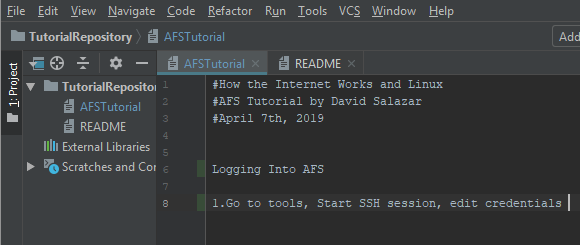
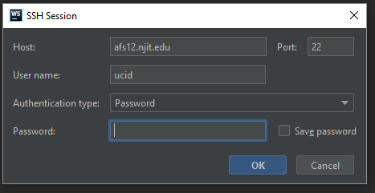
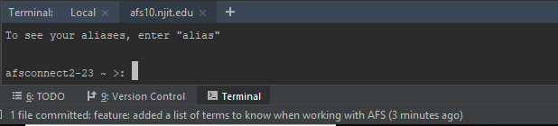
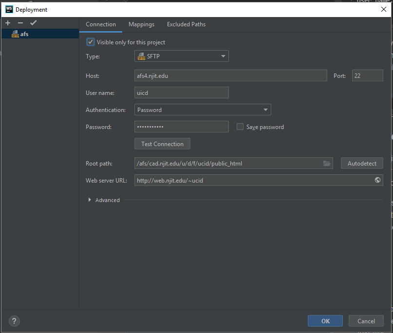
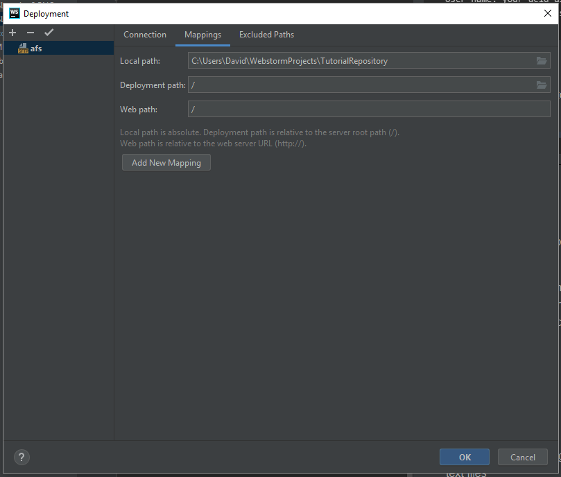
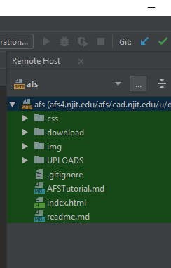

# How the Internet Works and Linux
# AFS Tutorial by David Salazar
# April 7th, 2019

### Logging Into AFS 

1.Go to tools, Start SSH session, edit credentials.

2. In the following window,

    Enter the following, 
    * Host: afs(any number between 1-22).njit.edu
    * Port: 22
    * User name: your ucid username
    * Password: your ucid password
    
3. The following terminal window shows after successfully logging into AFS, 

### Deployment
used to have files of a website locally and linked to a website remote 

1. Go to tools, Deployment, and select configuration, click on the + tab, name host, select SFTP

 

    Enter the following, 
    * Host: afs(any number between 1-22).njit.edu
    * Port: 22
    * User name: your ucid username
    * Password: your ucid password
    * Test Connection. Make sure that the root path has /ucid/public html
    * Webserver URL should read: http://web.njit.edu/~dfs23
    
2. In the deployment window select Mappings and add / in the Deployment path 

3. Add a .gitignore file to your project, and include .idea inside the file, and commit

4. Select Tools, Deployment, Automatic upload

5. Tools, Deployment, Browse Remote Host. The remote host w/ files will appear on the upper right side of your screen.

6. Scroll over to the location of your remote host afs files (in step 5), and right click on the index.html file. 
   Select the download from here option. Commit now. 
   

### Terms to Know 
1. Secure Socket Shell (SSH): used for sending text files 
2. Port 22 in SSH: utilizes encryption
3. Standard File Transfer File Protocol (SFTP) : also known as Secure Socket Shell, and this 
                                                 sets up files that get automatically updated
                                                 in the afs server. the S in front of FTP means 
                                                 that encryption is used. In order for encryption
                                                 to be used, Port 22 was selected
